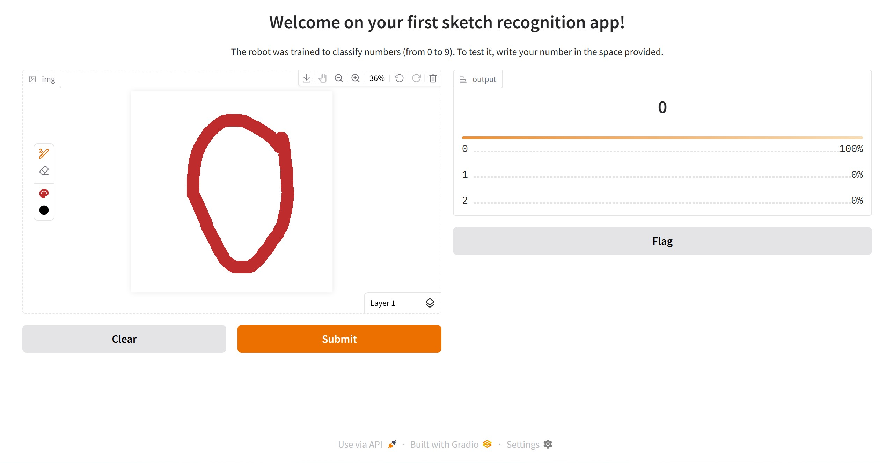
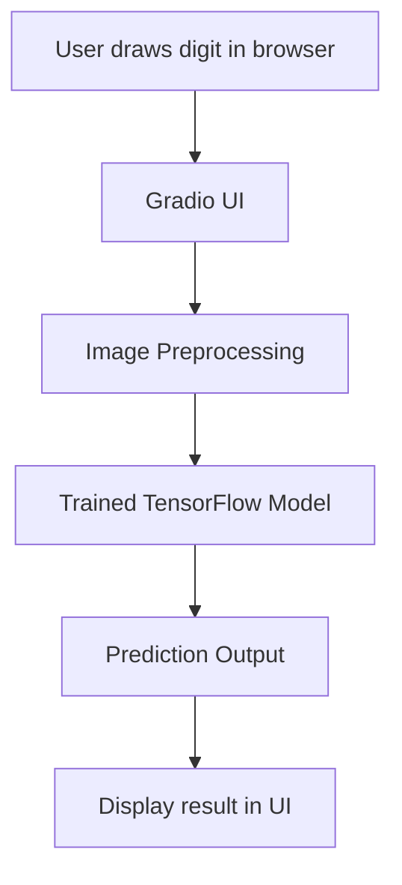

# <div align="center">✏️ Handwritten-Digits-Classification ✏️</div>

<div align="center">

     

_An AI-driven web app for handwritten digit recognition using the MNIST dataset. It leverages TensorFlow for deep learning model training and Gradio to create an intuitive, interactive UI. Users can draw digits and receive instant predictions, showcasing practical AI deployment and real-time inference capabilities._

</div>

---

<div align="justify">

## Table of Contents

- [Overview](#overview)
- [Features](#features)
- [Demo](#demo)
- [Architecture](#architecture)
- [Project Structure](#project-structure)
- [Installation](#installation)
- [Environment Variables](#environment-variables)
- [Usage](#usage)
- [Model Details](#model-details)
- [Gradio Interface](#gradio-interface)
- [Configuration](#configuration)
- [Testing](#testing)
- [Deployment](#deployment)
- [Customization](#customization)
- [Performance Tips](#performance-tips)
- [Code Walkthrough](#code-walkthrough)
- [Troubleshooting](#troubleshooting)
- [FAQ](#faq)
- [Contributing](#contributing)
- [License](#license)
- [References](#references)
- [Acknowledgements](#acknowledgements)
- [Contact](#contact)

---

## Project Content

### 1. Application Code (`app/`)
- **`main.py`**  
  The main entry point for the application. It loads the trained Keras model and launches a Gradio web interface, allowing users to draw digits and receive instant predictions.

- **`configs/system-variables.py`**  
  Contains system configuration variables such as the model path, input size, and other settings that control the app’s behavior.

- **`configs/__init__.py`**  
  Marks the `configs` directory as a Python package.

---

### 2. Models (`models/`)
- **`model.keras`**  
  The pre-trained Keras model file used for digit classification.

- **`training.ipynb`**  
  A Jupyter notebook for training and evaluating the model on the MNIST dataset. Users can retrain the model, experiment with different architectures, and save new models.

---

### 3. Documentation (`docs/`)
- **`gradio.md`**  
  Documentation on using Gradio for the user interface, including setup and customization tips.

- **`mnist-dataset.md`**  
  Information about the MNIST dataset, its structure, and how it is used in this project.

- **`tensorflow.md`**  
  Guidance and notes on using TensorFlow within the project, including installation and troubleshooting.

---

### 4. Project Management & Metadata
- **`README.md`**  
  The main documentation file, providing an overview, setup instructions, usage, customization, deployment, troubleshooting, and more.

- **`requirements.txt`**  
  Lists all Python dependencies required to run the project, such as TensorFlow and Gradio.

- **`LICENSE`**  
  The MIT License file, specifying the terms for open-source use and distribution.

---

### 5. Key Features
- **Interactive Gradio UI:**  
  Users can draw digits in their browser and receive real-time predictions from the trained model.

- **Deep Learning Model:**  
  Utilizes a Convolutional Neural Network (CNN) trained on the MNIST dataset for high-accuracy digit recognition.

- **Easy Retraining:**  
  The included Jupyter notebook allows users to retrain the model or experiment with new architectures.

- **Configurable:**  
  System variables and settings can be easily adjusted in the configuration files.

- **Well-Documented:**  
  Comprehensive guides and code comments are provided for easy understanding and customization.

---

### 6. Example Directory Structure

```
Handwritten-Digits-Classification/
│
├── app/
│   ├── configs/
│   │   ├── __init__.py
│   │   └── system-variables.py
│   └── main.py
│
├── docs/
│   ├── gradio.md
│   ├── mnist-dataset.md
│   └── tensorflow.md
│
├── models/
│   ├── model.keras
│   └── training.ipynb
│
├── README.md
├── requirements.txt
└── LICENSE
```

---

## Overview

This project demonstrates a complete pipeline for handwritten digit recognition using deep learning. It includes:

- Training a neural network on the MNIST dataset.
- Saving and loading the trained model.
- Deploying the model as a web app using Gradio, allowing users to draw digits and get instant predictions.

The project is ideal for learning about computer vision, neural networks, and deploying AI models in real-world applications.

---

## Features

- 🧠 **Deep Learning Model**: Built with TensorFlow/Keras, trained on MNIST.
- 🖼️ **Interactive UI**: Draw digits directly in your browser using Gradio.
- ⚡ **Real-Time Inference**: Instant predictions as you draw.
- 🔄 **Easy Retraining**: Jupyter notebook provided for model retraining.
- 🛠️ **Configurable**: System variables and settings are easily adjustable.
- 📦 **Portable**: Simple requirements, easy to run locally.
- 📝 **Well-Documented**: Includes guides and code comments for easy understanding.
- 🧪 **Tested**: Model and app tested for accuracy and usability.
- 🌐 **Deployable**: Ready for deployment on cloud or local servers.
- 🔒 **Secure**: No user data is stored or transmitted externally.

---

## Demo

> **Live Demo:** _Coming soon!_

 <!-- Replace with actual screenshot if available -->

---

## Architecture



- **Frontend**: Gradio web interface for drawing and displaying results.
- **Backend**: Python server running TensorFlow model for inference.
- **Model**: CNN trained on MNIST dataset.

---

## Project Structure

```
Handwritten-Digits-Classification/
│
├── app/
│   ├── configs/
│   │   ├── __init__.py
│   │   └── system-variables.py
│   └── main.py
│
├── docs/
│   ├── gradio.md
│   ├── mnist-dataset.md
│   └── tensorflow.md
│
├── models/
│   ├── model.keras
│   └── training.ipynb
│
├── README.md
├── requirements.txt
└── LICENSE
```

- **app/**: Main application code and configuration.
- **docs/**: Documentation and guides.
- **models/**: Trained model and training notebook.
- **requirements.txt**: Python dependencies.

---

## Installation

### 1. Clone the Repository

```bash
git clone https://github.com/NhanPhamThanh-IT/Handwritten-Digits-Classification.git
cd Handwritten-Digits-Classification
```

### 2. Create a Virtual Environment (Recommended)

```bash
python -m venv venv
source venv/bin/activate  # On Windows: venv\Scripts\activate
```

### 3. Install Dependencies

```bash
pip install -r requirements.txt
```

---

## Environment Variables

You can configure the following environment variables (optional):

| Variable    | Description                    | Default Value      |
| ----------- | ------------------------------ | ------------------ |
| MODEL_PATH  | Path to the trained model file | models/model.keras |
| GRADIO_PORT | Port for Gradio web server     | 7860               |
| DEBUG       | Enable debug mode (True/False) | False              |

Set them in your shell or in a `.env` file (if using `python-dotenv`).

---

## Usage

### 1. Train the Model (Optional)

If you want to retrain the model, open the Jupyter notebook:

```bash
jupyter notebook models/training.ipynb
```

Follow the notebook instructions to train and save a new model.

### 2. Run the Web App

```bash
python app/main.py
```

This will launch the Gradio interface in your browser. Draw a digit and see the prediction in real time!

#### Custom Port

```bash
GRADIO_PORT=8080 python app/main.py
```

---

## Model Details

- **Dataset**: [MNIST](http://yann.lecun.com/exdb/mnist/)
- **Architecture**: Convolutional Neural Network (CNN)
- **Framework**: TensorFlow / Keras
- **Input**: 28x28 grayscale images
- **Output**: Digit class (0-9)
- **Training Notebook**: `models/training.ipynb`
- **Saved Model**: `models/model.keras`

### Example Model Architecture

```python
import tensorflow as tf
from tensorflow.keras import layers, models

model = models.Sequential([
    layers.Input(shape=(28, 28, 1)),
    layers.Conv2D(32, (3, 3), activation='relu'),
    layers.MaxPooling2D((2, 2)),
    layers.Conv2D(64, (3, 3), activation='relu'),
    layers.MaxPooling2D((2, 2)),
    layers.Flatten(),
    layers.Dense(64, activation='relu'),
    layers.Dense(10, activation='softmax')
])
```

---

## Gradio Interface

The app uses Gradio to provide a user-friendly web interface:

- **Draw Area**: Use your mouse or touchscreen to draw a digit.
- **Predict Button**: Instantly see the model's prediction and confidence.
- **Clear Button**: Reset the canvas to try again.

### Example Gradio Integration

```python
import gradio as gr
import numpy as np
from tensorflow.keras.models import load_model

model = load_model('models/model.keras')

def predict_digit(image):
    image = image.reshape(1, 28, 28, 1) / 255.0
    prediction = model.predict(image)
    return {str(i): float(prediction[0][i]) for i in range(10)}

iface = gr.Interface(
    fn=predict_digit,
    inputs=gr.Image(shape=(28, 28), image_mode='L', invert_colors=True, source='canvas'),
    outputs=gr.Label(num_top_classes=3),
    live=True,
    title="Handwritten Digit Recognition",
    description="Draw a digit (0-9) and the model will predict it!"
)

iface.launch()
```

For more details, see [docs/gradio.md](docs/gradio.md).

---

## Configuration

System variables and settings can be adjusted in:

- `app/configs/system-variables.py`

You can modify parameters such as model path, input size, etc.

---

## Testing

To test the model or app:

1. **Unit Tests**: (Add your own tests in a `tests/` directory)
2. **Manual Testing**: Run the app and try drawing various digits.
3. **Model Evaluation**: Use the notebook to evaluate accuracy on the MNIST test set.

---

## Deployment

### Deploy on Hugging Face Spaces

- [Gradio + Hugging Face Spaces Guide](https://gradio.app/docs/hosting_on_huggingface/)

### Deploy on Heroku

1. Add a `Procfile`:
   ```
   web: python app/main.py
   ```
2. Push to Heroku and set buildpacks for Python.

### Docker Deployment

1. Create a `Dockerfile`:
   ```dockerfile
   FROM python:3.10
   WORKDIR /app
   COPY . .
   RUN pip install -r requirements.txt
   EXPOSE 7860
   CMD ["python", "app/main.py"]
   ```
2. Build and run:
   ```bash
   docker build -t digit-classifier .
   docker run -p 7860:7860 digit-classifier
   ```

---

## Customization

- **Change Model**: Edit and retrain in `models/training.ipynb`.
- **Change UI**: Modify Gradio interface in `app/main.py`.
- **Add Features**: E.g., upload image, batch prediction, etc.

---

## Performance Tips

- Use GPU for faster training (see TensorFlow docs).
- Optimize model size for faster inference.
- Use quantization or pruning for deployment on edge devices.

---

## Code Walkthrough

- **app/main.py**: Entry point for the Gradio app. Loads the model and defines the prediction function.
- **models/training.ipynb**: Jupyter notebook for training and evaluating the model.
- **app/configs/system-variables.py**: Stores configuration variables (e.g., model path).
- **docs/**: Contains additional documentation on Gradio, MNIST, and TensorFlow.

---

## Troubleshooting

- **Gradio not launching?**

  - Ensure all dependencies are installed.
  - Try running `python -m pip install --upgrade pip` and reinstall requirements.

- **Model not found?**

  - Make sure `models/model.keras` exists, or retrain using the notebook.

- **Jupyter not found?**

  - Install with `pip install notebook`.

- **Other issues?**
  - Check the [docs/](docs/) folder for more help.

---

## FAQ

**Q: Can I use my own dataset?**  
A: Yes! Modify the training notebook to load your dataset and retrain the model.

**Q: How do I improve accuracy?**  
A: Try deeper networks, data augmentation, or hyperparameter tuning in the notebook.

**Q: Can I deploy this app online?**  
A: Yes! Gradio supports easy deployment to Hugging Face Spaces, or you can use services like Heroku, AWS, or Azure.

**Q: How do I change the model architecture?**  
A: Edit the model definition in `models/training.ipynb` and retrain.

**Q: Why is my prediction always wrong?**  
A: Make sure you draw clearly within the box, and the model is properly loaded.

**Q: How do I run on a different port?**  
A: Set the `GRADIO_PORT` environment variable.

---

## Contributing

Contributions are welcome! Please open issues or pull requests for suggestions, bug fixes, or improvements.

### How to Contribute

1. Fork the repository.
2. Create a new branch (`git checkout -b feature/your-feature`).
3. Make your changes.
4. Commit and push (`git commit -am 'Add new feature' && git push origin feature/your-feature`).
5. Open a pull request.

---

## License

This project is licensed under the MIT License. See [LICENSE](LICENSE) for details.

---

## References

- [MNIST Dataset](http://yann.lecun.com/exdb/mnist/)
- [TensorFlow Documentation](https://www.tensorflow.org/)
- [Gradio Documentation](https://gradio.app/)
- [Keras Documentation](https://keras.io/)
- [Jupyter Notebook](https://jupyter.org/)

---

## Acknowledgements

- Inspired by classic MNIST digit recognition projects.
- Thanks to the open-source community for tools and datasets.

---

## Contact

For questions or support, please open an issue or contact ptnhanit230104@gmail.com.

---

## API Endpoints

The app can be extended to provide a REST API for predictions.

| Endpoint   | Method | Description                | Input         | Output      |
|------------|--------|----------------------------|---------------|-------------|
| `/predict` | POST   | Predict digit from image   | 28x28 image   | JSON result |

**Example Request:**
```bash
curl -X POST -F "image=@digit.png" http://localhost:7860/predict
```

---

## Advanced Customization

- **Add New Preprocessing Steps:**  
  Edit the image preprocessing logic in `app/main.py` to include noise reduction, thresholding, or resizing.

- **Support for Color Images:**  
  Change the input shape and preprocessing to handle RGB images.

- **Batch Prediction:**  
  Modify the Gradio interface to accept and predict multiple images at once.

- **Logging and Monitoring:**  
  Integrate tools like TensorBoard or Weights & Biases for experiment tracking.

---

## Security Considerations

- Ensure the app is run behind a secure proxy (e.g., Nginx) in production.
- Use HTTPS for all external deployments.
- Validate and sanitize all user inputs.
- Do not expose sensitive environment variables or model internals.

---

## Changelog

- **v1.0.0**: Initial release with Gradio UI and MNIST model.
- **v1.1.0**: Added configuration file and environment variable support.
- **v1.2.0**: Improved documentation and added Docker support.

---

## Related Projects

- [keras-io/examples/vision/mnist_convnet.py](https://github.com/keras-team/keras-io/blob/master/examples/vision/mnist_convnet.py)
- [Gradio MNIST Example](https://gradio.app/get_started)

---

## Community & Support

- [GitHub Discussions](https://github.com/NhanPhamThanh-IT/Handwritten-Digits-Classification/discussions)
- [Stack Overflow](https://stackoverflow.com/questions/tagged/mnist)
- Email: ptnhanit230104@gmail.com

</div>
